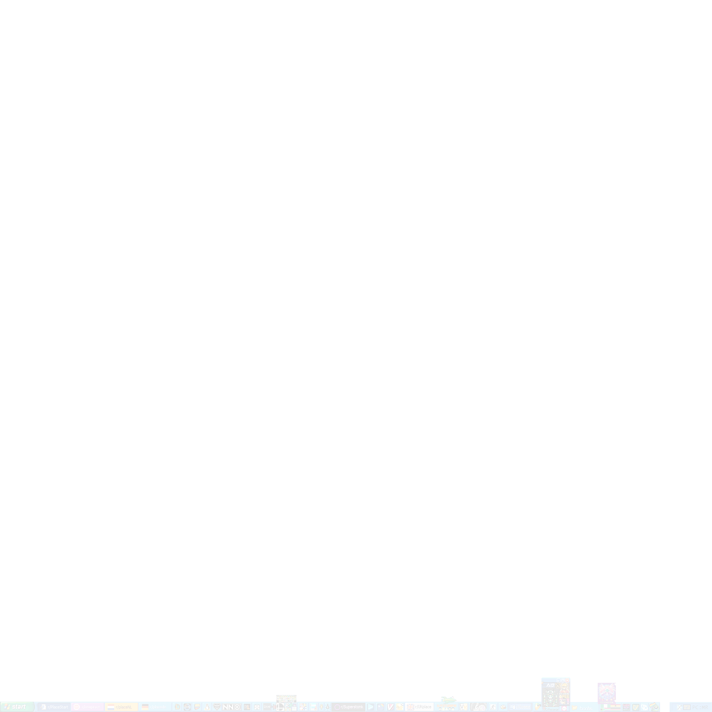

## Installing

1. Install browser extension [Tampermonkey](https://www.tampermonkey.net/) or [Violentmonkey (Firefox)](https://addons.mozilla.org/en-US/firefox/addon/violentmonkey/).
2. Install the script by clicking [**HERE**](https://github.com/portalthree/place-taskbar-bot/raw/main/overlay.user.js). Tampermonkey should open up and you can click _install_.
3. Refresh /r/place. (Make sure you're not on cooldown before you refresh). In the top right corner you should see messages of the bot asking for an access token and then placing a pixel.
## Template

